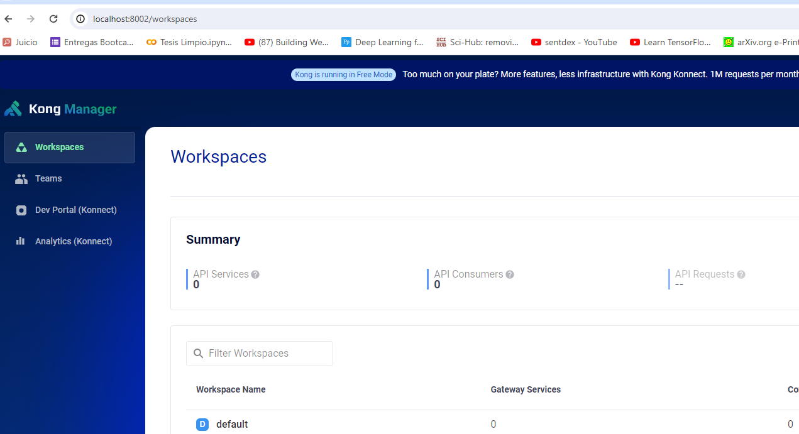
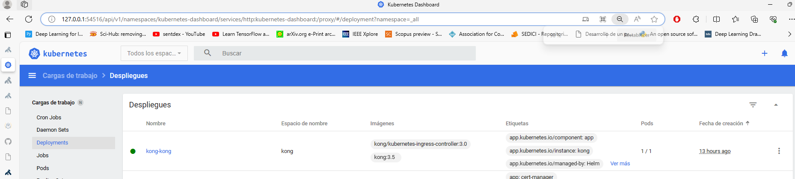
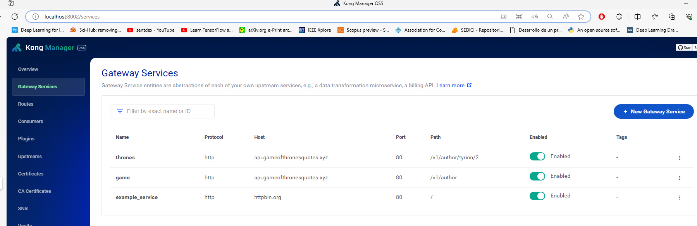
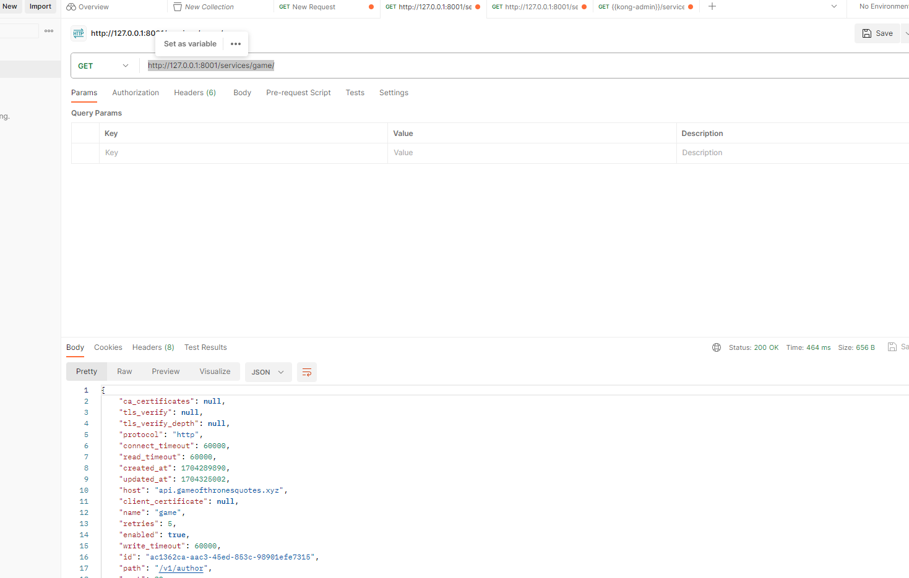
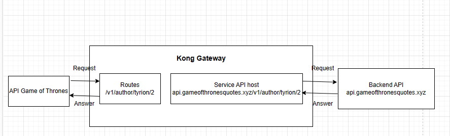

1. Procedemos con la instalacion de Kong utilizando helm.

    a. Creamos el namespace kong
        kubectl create namespace kong
    b Creamos el secret que utilizan los 3 pods que se ejecutan.

        kubectl create secret generic kong-config-secret -n kong \
            --from-literal=portal_session_conf='{"storage":"kong","secret":"super_secret_salt_string","cookie_name":"portal_session","cookie_same_site":"Lax","cookie_secure":false}' \
            --from-literal=admin_gui_session_conf='{"storage":"kong","secret":"super_secret_salt_string","cookie_name":"admin_session","cookie_same_site":"Lax","cookie_secure":false}' \
            --from-literal=pg_host="enterprise-postgresql.kong.svc.cluster.local" \
            --from-literal=kong_admin_password=kong \
            --from-literal=password=kong
  
   c. helm install kong/kong --generate-name

   d. Creamos una licencia free
       kubectl create secret generic kong-enterprise-license --from-literal=license="'{}'" -n kong --dry-run=client -o yaml | kubectl apply -f -
    f. Instalamos el cert manager
        helm upgrade --install cert-manager jetstack/cert-manager  --set installCRDs=true --namespace cert-manager --create-namespace
    g. Creamos los certificados correspondientes

                bash -c "cat <<EOF | kubectl apply -n kong -f -
            apiVersion: cert-manager.io/v1
            kind: Issuer
            metadata:
            name: quickstart-kong-selfsigned-issuer-root
            spec:
            selfSigned: {}
            ---
            apiVersion: cert-manager.io/v1
            kind: Certificate
            metadata:
            name: quickstart-kong-selfsigned-issuer-ca
            spec:
            commonName: quickstart-kong-selfsigned-issuer-ca
            duration: 2160h0m0s
            isCA: true
            issuerRef:
                group: cert-manager.io
                kind: Issuer
                name: quickstart-kong-selfsigned-issuer-root
            privateKey:
                algorithm: ECDSA
                size: 256
            renewBefore: 360h0m0s
            secretName: quickstart-kong-selfsigned-issuer-ca
            ---
            apiVersion: cert-manager.io/v1
            kind: Issuer
            metadata:
            name: quickstart-kong-selfsigned-issuer
            spec:
            ca:
                secretName: quickstart-kong-selfsigned-issuer-ca
            EOF"
 

2. Kong se esta ejecutando

    
    
3. Procedemos a la creacion del gateway para la API requerida
    a. Para ello utilizamos el comando 
      curl -i -s -X POST http://localhost:8001/services  --data name=game  --data host='https://api.gameofthronesquotes.xyz' --data path=/v1

    

4. Utilziamos POSTMAN para evaluar el funcionamiento del API gateway creado
    Para ello utilizamos un comando CURL GET
    a. 

5. Diagrama de alto nivel
